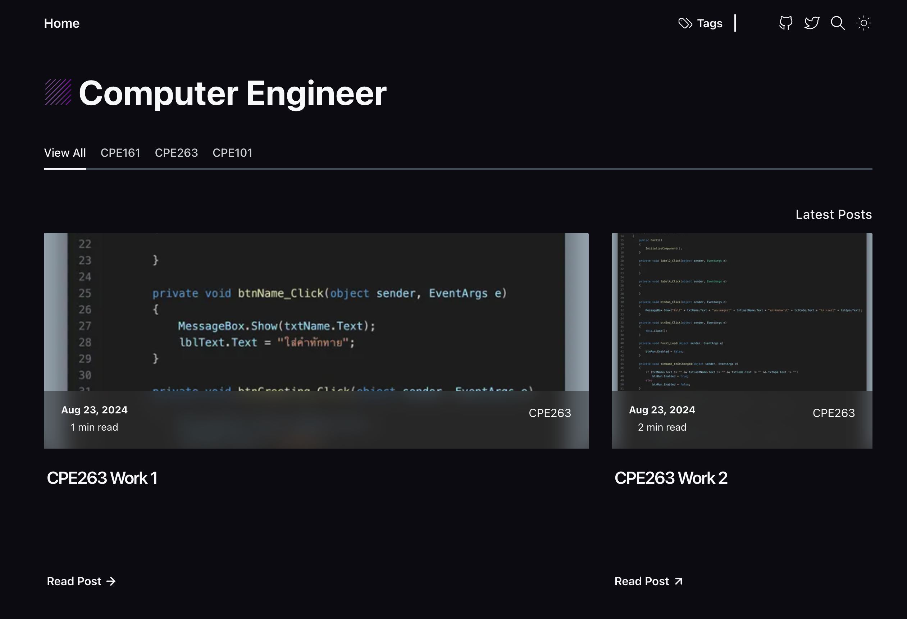

<div align="center">



<hr/>
</div>
<p>
 Computer Engineering covers both fundamental and specialized courses such as programming, digital circuits, operating systems, and computer networks. The program emphasizes both theoretical and practical learning to prepare students for careers in the technology industry.
</p>

## 📌 Table Of Contents

1. [Demo](#-Demo)
2. [CMS](#-Tina-CMS)
3. [Features](#-Features)
4. [Roadmap](#-Roadmap)
5. [Stack](#-Stack)
6. [Running locally](#-Running-Locally)
7. [Configure](#-Configure)
8. [Categories](#-Adding-a-category)
9. [Posts](#-Adding-a-post)
10. [Draft](#-Activating-draft-mode)
11. [FrontMatter](#-Frontmatter)
12. [CLI](#-Commands)
13. [Contributors](#-Contributors)

# Blog Template

This project is a fork of the [Blog Template](https://github.com/danielcgilibert/blog-template) created by Daniel C. Gilibert. It serves as a starting point for building a customizable blog with modern web technologies.

## Features

- Responsive design
- Easy customization
- Lightweight and fast

## Installation

To get started with this project, follow these steps:

1. Clone the repository:

   ```bash
   git clone https://github.com/pxsstx/computer-engineer.git
   cd blog-template
   ```

2. Install the dependencies:
   ```bash
   npm install
   ```

## Usage
To run the project locally, use the following command:
```bash
   npm run dev
```

This will start the development server, and you can view your blog at http://localhost:4321.

## Customization
You can customize the template to fit your needs:

- Components: Modify the React components in the src/components directory to add, remove, or change the structure of your blog.
Styles: Tailwind CSS is used for styling. You can adjust the design by editing the classes directly in the JSX files or by extending Tailwind in the tailwind.config.js file.
- Content: Add your markdown files to the content directory to create new blog posts. The project uses a static site generator to render the content dynamically.
Contributing
- Contributions are welcome! If you have ideas to improve this template or want to report a bug, feel free to open an issue or submit a pull request.

## License
- This project is licensed under the MIT License. See the LICENSE file for more details.

## Acknowledgements
**Daniel C.** Gilibert for the original Blog Template.
The React and Tailwind CSS communities for their awesome tools and resources.

