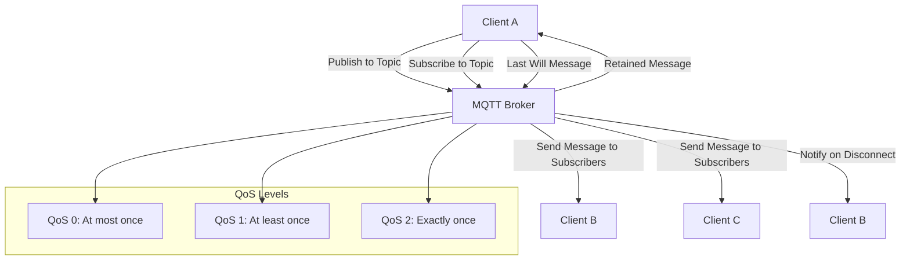

## MQTT (Message Queuing Telemetry Transport)
- Lightweight Protocol: Designed for low-bandwidth and high-latency networks.
- Publish/Subscribe Model: Clients can publish messages to topics and subscribe to receive them, promoting decoupled communication.
- Quality of Service (QoS):
  - QoS 0: At most once (fire-and-forget).
  - QoS 1: At least once (guaranteed delivery).
  - QoS 2: Exactly once (no duplicates).
- Retained Messages: Last message on a topic can be retained by the broker for new subscribers.
- Last Will and Testament (LWT): Clients can specify a message for the broker to send if they disconnect unexpectedly.
- Security: Can be secured using TLS/SSL for encrypted communication.
- Common Use Cases: Smart homes, remote monitoring, sensor networks, and fleet management.

### MQTT Architecture Diagram

Here’s a diagram illustrating the MQTT architecture:


---

## MQTT 

### NodeMcu
```c
#include <ESP8266WiFi.h>
#include <PubSubClient.h>

const char* ssid = "your_ssid"; // WiFi SSID
const char* password = "your_password"; // WiFi Password
const char* mqtt_server = "broker.mqtt-dashboard.com"; // MQTT Broker

WiFiClient espClient;
PubSubClient client(espClient);

long lastMsg = 0;
#define MSG_BUFFER_SIZE (50)
char msg[MSG_BUFFER_SIZE];
int value = 0;

// Function to connect to WiFi
void setup_wifi() {
    delay(10);
    Serial.println();
    Serial.print("Connecting to ");
    Serial.println(ssid);
    WiFi.begin(ssid, password);
    while (WiFi.status() != WL_CONNECTED) {
        delay(500);
        Serial.print(".");
    }
    randomSeed(micros());
    Serial.println("");
    Serial.println("WiFi connected");
    Serial.print("IP address: ");
    Serial.println(WiFi.localIP());
}

// Callback function for incoming messages
void callback(char* topic, byte* payload, unsigned int length) {
    Serial.print("Message arrived [");
    Serial.print(topic);
    Serial.print("] ");
    for (int i = 0; i < length; i++) {
        Serial.print((char)payload[i]);
    }
    Serial.println();

    // Control the built-in LED based on the payload
    if ((char)payload[0] == '1') {
        digitalWrite(BUILTIN_LED, LOW);
    } else {
        digitalWrite(BUILTIN_LED, HIGH);
    }
}

// Function to reconnect to the MQTT broker
void reconnect() {
    while (!client.connected()) {
        Serial.print("Attempting MQTT connection...");
        String clientId = "ESP8266Client-";
        clientId += String(random(0xffff), HEX);
        
        if (client.connect(clientId.c_str())) {
            Serial.println("connected");
            client.publish("outTopic", "hello world");
            client.subscribe("inTopic");
        } else {
            Serial.print("failed, rc=");
            Serial.print(client.state());
            Serial.println(" try again in 5 seconds");
            delay(5000);
        }
    }
}

// Setup function
void setup() {
    pinMode(BUILTIN_LED, OUTPUT);
    Serial.begin(115200);
    setup_wifi();
    client.setServer(mqtt_server, 1883);
    client.setCallback(callback);
}

// Main loop function
void loop() {
    if (!client.connected()) {
        reconnect();
    }
    client.loop();

    long now = millis();
    if (now - lastMsg > 2000) {
        lastMsg = now;
        ++value;
        snprintf(msg, MSG_BUFFER_SIZE, "hello world #%ld", value);
        Serial.print("Publish message: ");
        Serial.println(msg);
        client.publish("outTopic", msg);
    }
}
```
---
### Publisher 
```c
#include <ESP8266WiFi.h>
#include <PubSubClient.h>

const char* ssid = "........"; // WiFi SSID
const char* password = "........"; // WiFi Password
const char* mqtt_server = "broker.mqtt-dashboard.com"; // MQTT Broker

WiFiClient espClient;
PubSubClient client(espClient);

long lastMsg = 0;
#define MSG_BUFFER_SIZE (50)
char msg[MSG_BUFFER_SIZE];
int value = 0;

// Function to connect to WiFi
void setup_wifi() {
    delay(10);
    Serial.println();
    Serial.print("Connecting to ");
    Serial.println(ssid);
    WiFi.begin(ssid, password);
    while (WiFi.status() != WL_CONNECTED) {
        delay(500);
        Serial.print(".");
    }
    randomSeed(micros());
    Serial.println("");
    Serial.println("WiFi connected");
    Serial.print("IP address: ");
    Serial.println(WiFi.localIP());
}

// Callback function for incoming messages
void callback(char* topic, byte* payload, unsigned int length) {
    Serial.print("Message arrived [");
    Serial.print(topic);
    Serial.print("] ");
    for (int i = 0; i < length; i++) {
        Serial.print((char)payload[i]);
    }
    Serial.println();
}

// Function to reconnect to the MQTT broker
void reconnect() {
    while (!client.connected()) {
        Serial.print("Attempting MQTT connection...");
        
        // Create a random client ID
        String clientId = "ESP8266Client-";
        clientId += String(random(0xffff), HEX);
        
        // Attempt to connect
        if (client.connect(clientId.c_str())) {
            Serial.println("connected");
            client.publish("outTopic", "hello world"); // Publish an announcement
            // client.subscribe("inTopic"); // Resubscribe removed
        } else {
            Serial.print("failed, rc=");
            Serial.print(client.state());
            Serial.println(" try again in 5 seconds");
            delay(5000);
        }
    }
}

// Setup function
void setup() {
    Serial.begin(115200); // Start serial communication at 115200 baud
    setup_wifi(); // Connect to WiFi
    client.setServer(mqtt_server, 1883); // Set MQTT server and port
    client.setCallback(callback); // Set the callback function for incoming messages
}

// Main loop function
void loop() {
    if (!client.connected()) {
        reconnect(); // Reconnect if not connected
    }
    client.loop(); // Process incoming messages

    long now = millis();
    if (now - lastMsg > 2000) { // Publish a message every 2 seconds
        lastMsg = now;
        ++value;
        snprintf(msg, MSG_BUFFER_SIZE, "hello world #%ld", value);
        Serial.print("Publish message: ");
        Serial.println(msg);
        client.publish("outTopic", msg); // Publish the message
    }
}
```
---
### subscriber
```c
#include <ESP8266WiFi.h>
#include <PubSubClient.h>

const char* ssid = "........"; // WiFi SSID
const char* password = "........"; // WiFi Password
const char* mqtt_server = "broker.mqtt-dashboard.com"; // MQTT Broker

WiFiClient espClient;
PubSubClient client(espClient);

long lastMsg = 0;
#define MSG_BUFFER_SIZE (50)
char msg[MSG_BUFFER_SIZE];
int value = 0;

// Function to connect to WiFi
void setup_wifi() {
    delay(10);
    Serial.println();
    Serial.print("Connecting to ");
    Serial.println(ssid);
    WiFi.begin(ssid, password);
    while (WiFi.status() != WL_CONNECTED) {
        delay(500);
        Serial.print(".");
    }
    randomSeed(micros());
    Serial.println("");
    Serial.println("WiFi connected");
    Serial.print("IP address: ");
    Serial.println(WiFi.localIP());
}

// Callback function for incoming messages
void callback(char* topic, byte* payload, unsigned int length) {
    Serial.print("Message arrived [");
    Serial.print(topic);
    Serial.print("] ");
    for (int i = 0; i < length; i++) {
        Serial.print((char)payload[i]);
    }
    Serial.println();
}

// Function to reconnect to the MQTT broker
void reconnect() {
    while (!client.connected()) {
        Serial.print("Attempting MQTT connection...");
        
        // Create a random client ID
        String clientId = "ESP8266Client-";
        clientId += String(random(0xffff), HEX);
        
        // Attempt to connect
        if (client.connect(clientId.c_str())) {
            Serial.println("connected");
            // client.publish("outTopic", "hello world"); // Removed
            // client.subscribe("inTopic"); // Removed
        } else {
            Serial.print("failed, rc=");
            Serial.print(client.state());
            Serial.println(" try again in 5 seconds");
            delay(5000);
        }
    }
}

// Setup function
void setup() {
    // pinMode(BUILTIN_LED, OUTPUT); // Removed for Publisher #2
    Serial.begin(115200); // Start serial communication at 115200 baud
    setup_wifi(); // Connect to WiFi
    client.setServer(mqtt_server, 1883); // Set MQTT server and port
    client.setCallback(callback); // Set the callback function for incoming messages
}

// Main loop function
void loop() {
    if (!client.connected()) {
        reconnect(); // Reconnect if not connected
    }
    client.loop(); // Process incoming messages
}
```
